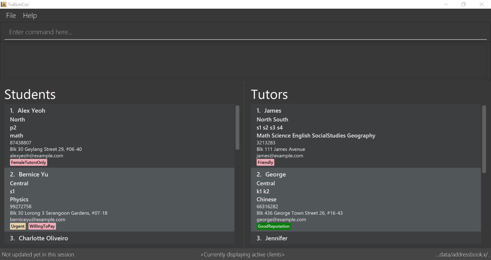

= TuitionCor
ifdef::env-github,env-browser[:relfileprefix: docs/]

https://travis-ci.org/CS2103JAN2018-F11-B2/main[image:https://travis-ci.org/CS2103JAN2018-F11-B2/main.svg?branch=master[Build Status]]

ifndef::env-github[]
image::images/Ui.PNG[width="600"]
endif::[]

* This is a desktop TuitionCor application. It has a GUI but most of the user interactions happen using a CLI (Command Line Interface).
* TuitionCor is targeted at tuition coordinators who have to manage a large amount of contacts.
* The daily job-scope of a tuition coordinator involves the need to manage large amount of contacts and match the students to tutors according to their credentials, needs and location.
* Therefore, TuitionCor aims to facilitate this process and make the job of a tuition coordinator easier.
*In addition, users are also able to
** find and filter contacts easily
** add and edit contacts

== Site Map

* <<UserGuide#, User Guide>>
* <<DeveloperGuide#, Developer Guide>>
* <<AboutUs#, About Us>>
* <<ContactUs#, Contact Us>>

== Acknowledgements

* Some parts of this sample application were inspired by the excellent http://code.makery.ch/library/javafx-8-tutorial/[Java FX tutorial] by
_Marco Jakob_.
* Libraries used: https://github.com/TomasMikula/EasyBind[EasyBind], https://github.com/TestFX/TestFX[TextFX], https://bitbucket.org/controlsfx/controlsfx/[ControlsFX], https://github.com/FasterXML/jackson[Jackson], https://github.com/google/guava[Guava], https://github.com/junit-team/junit4[JUnit4]

== Licence : link:LICENSE[MIT]
